# Flow Designer Scripting

## Purpose

Flow Designer scripting allows you to add **server-side JavaScript logic
inside a Flow Action** when out-of-the-box Flow logic (conditions,
lookups, updates) isn't enough.

It is primarily used for:

- Data transformation
- Conditional branching logic
- Calculations
- Complex record lookups
- Dynamic outputs

It is **not** meant to replace Script Includes or business logic layers.
See [Flow Script vs Business Rule](#flow-script-vs-business-rule)

---

## Where It Runs

- **Server-side**
- Executes within the Flow runtime engine
- Runs when the Flow is triggered
- Scoped to the application of the Flow

You do **not** have access to client-side objects like `g_form`.

---

#### Types of Flow Scripting

Workflow Editor is outdated and Flow Designer is now part of Workflow Studio.
Newer releases utilize Flow Designer

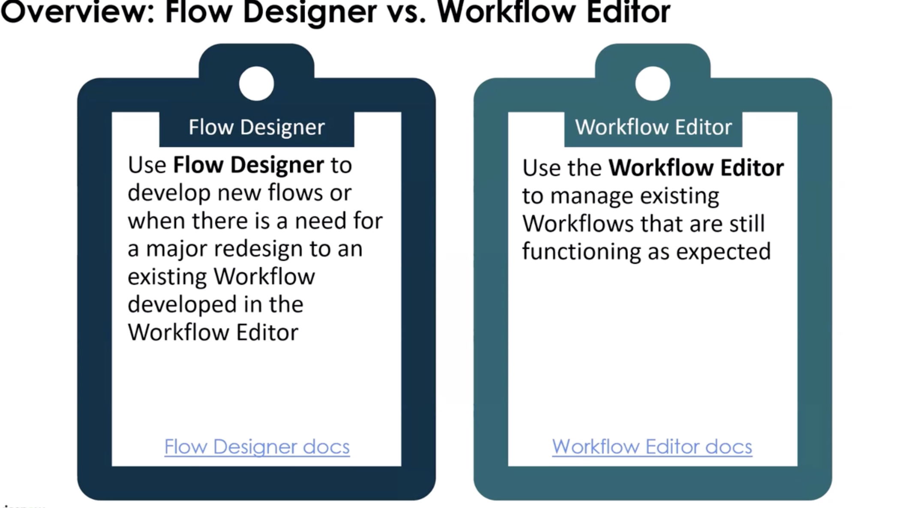

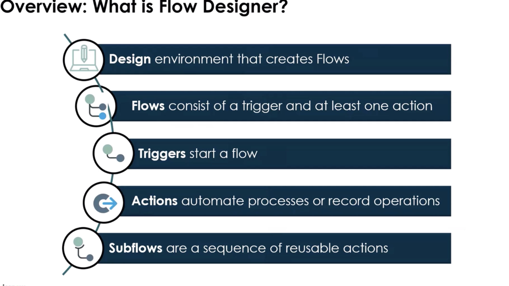

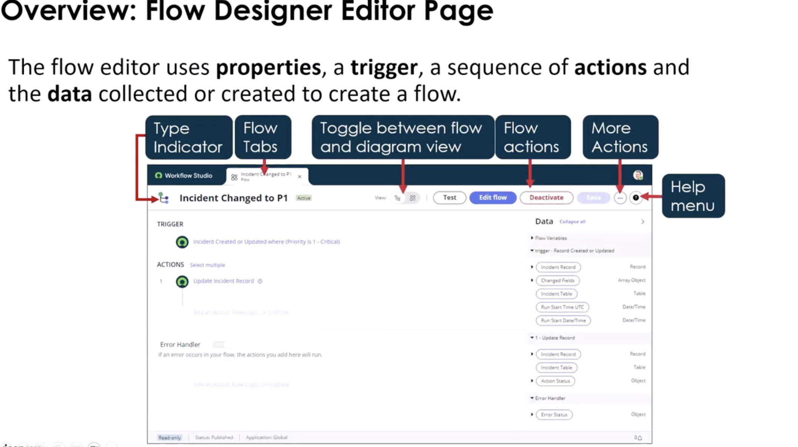

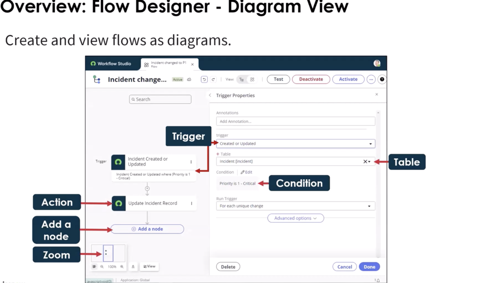

#### Types of Triggers

- Condition
- date-based
- application trigger: when you order something in the service catalog

#### Actions

A group of reusable operations that automate the Now Platform features without having to write code.
You can test the actions just like you would test a flow.

- Actions (can be custom), Flow Logic, or Subflows
- Subflows do not have to have a trigger you can call them from an action


### 1. Script Step (Inside Flow)

- Inline JavaScript
- Uses `inputs` and `outputs`
- Good for lightweight logic
- If used as a subflow, you do not have to use a Flow to make it run.
  -- Server-Side Scripts - Business Rule, UI Action, Script Includes
  -- Server-Side Apis - Can be used in a none-blocking mode
  -- Client-Side JS Library - GlideFlow --> uses promises
  -- THere is a Code Snippet Generator

  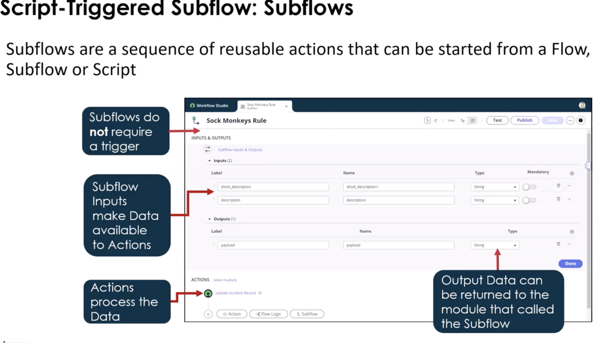
  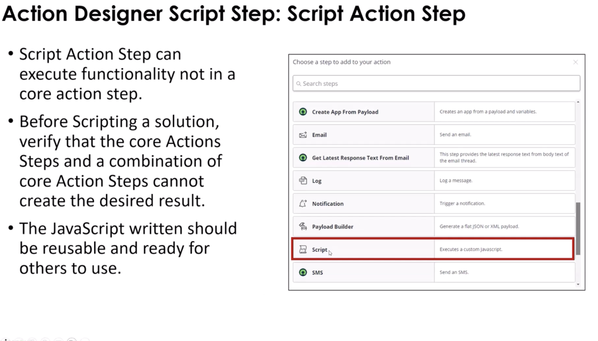

### 2. Custom Action Script

- Script inside a reusable Action
- Best practice when logic may be reused
- Encouraged for maintainability
- Use only when ServiceNow doesn't provide the functionality

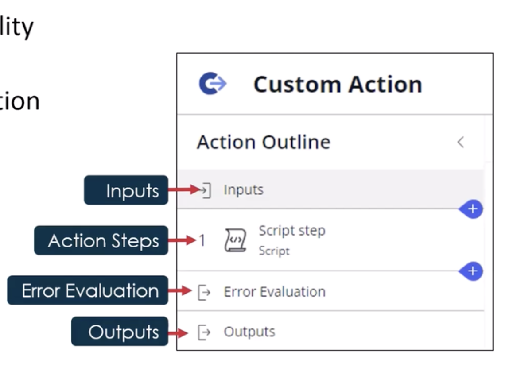


### 3. In-line Scripting

- Script inside a record or table for an action based on the current context
- Can be used for additional filtering on the current record
- Use if you need to set or modify values during a flow

## 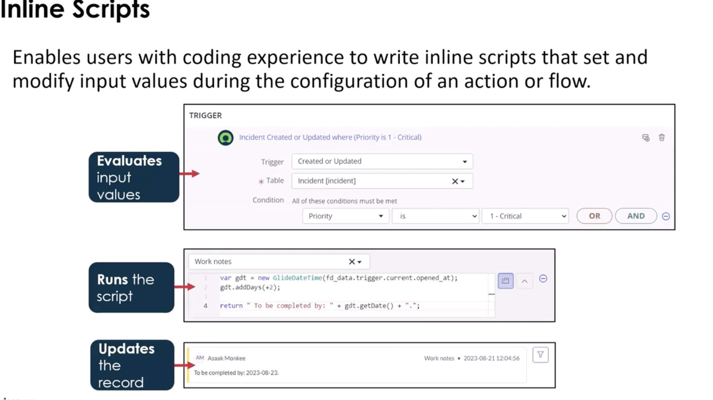

## Flow API vs FlowScript API

**Flow API**

- Designed for managing Flows programmatically (starting flows, retrieving context, etc.)
- Typically used outside a script step, e.g., in Script Includes, UI Actions, or other server scripts
- Provides high-level operations on Flow execution

**FlowScript API**

- Designed for inside Flow scripting steps
- Scoped to the current Flow context
- Provides access to inputs, outputs, current, and Flow-specific utility methods
- Meant for custom logic in the Flow, not for starting other Flows

| Feature          | Flow API                           | FlowScript API                                |
| ---------------- | ---------------------------------- | --------------------------------------------- |
| Scope            | External scripts / global          | Inside Flow script steps                      |
| Purpose          | Control or inspect Flows           | Run custom logic inside a Flow                |
| Access           | Flow context table, API methods    | inputs, outputs, current record               |
| Example Use Case | Start a Flow from a Script Include | Determine dynamic approver inside a Flow step |

**Note**:

- Flow API → Think “control Flows from outside”
- FlowScript API → Think “custom logic inside Flow”

## 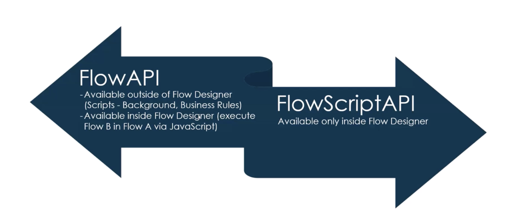

## ScriptableFlowRunner API

#### Call Order

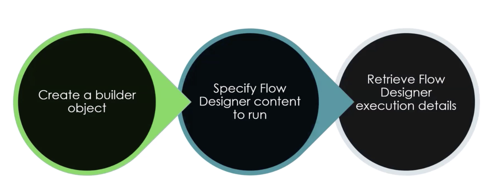

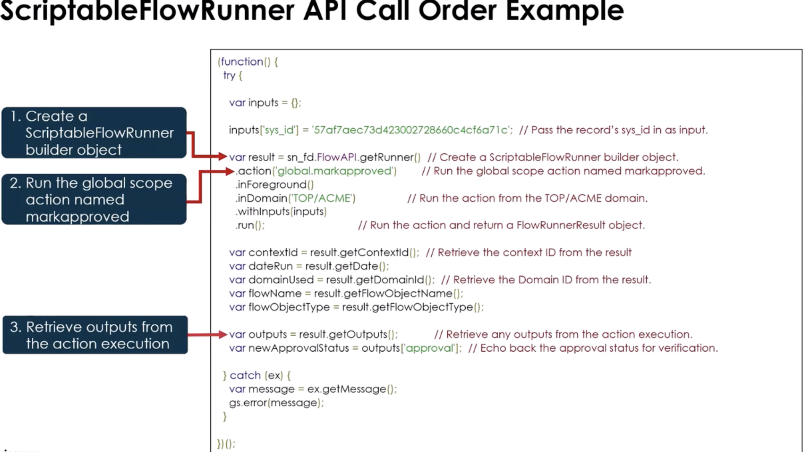

## Glide Flow API

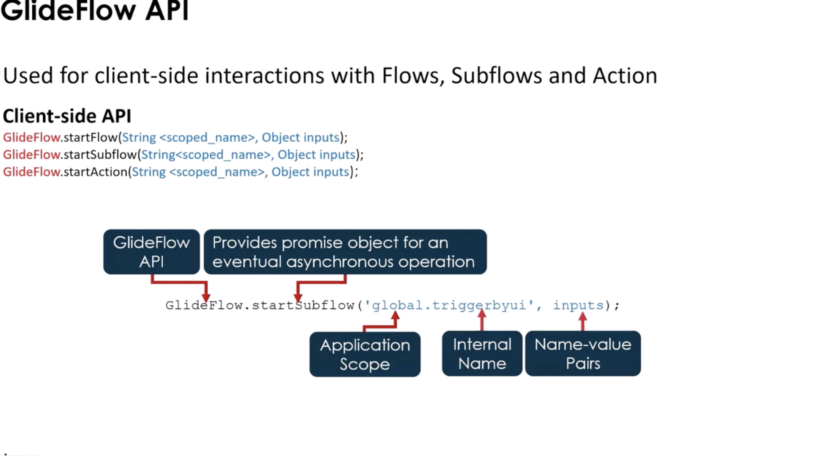

## Use When

Use Flow scripting when:

- You need logic not achievable via Flow conditions
- You need to manipulate or transform data
- You must dynamically determine values (approvers, assignment groups,
  etc.)
- You need multi-step record queries

Do **NOT** use it when:

- Logic is reusable across multiple Flows → use Script Include
- The logic is large or complex
- It belongs in core business rules
- You need synchronous database validation logic

---

## Script Structure

Inside a Script step:

```javascript
(function execute(inputs, outputs) {
  var gr = new GlideRecord("incident");
  gr.addQuery("priority", 1);
  gr.query();

  var count = 0;
  while (gr.next()) {
    count++;
  }

  outputs.highPriorityCount = count;
})(inputs, outputs);
```

### Key Objects

- `inputs` → Data passed into the script step
- `outputs` → Values returned to the Flow
- `current` → Available only in record-triggered Flows
- `GlideRecord` → For database operations
- `gs` → System logging

---

## What It Touches

- **Tables**
  - Flow context tables
  - Any table queried via GlideRecord
- **APIs**
  - GlideRecord
  - GlideAggregate
  - GlideSystem (`gs`)
  - Scoped APIs

Remember: It runs in **the application scope of the Flow**.
xs

---

## Performance Considerations

- Avoid large loops over massive tables
- Use indexed fields in queries
- Prefer `GlideAggregate` over manual counting
- Avoid unnecessary record updates inside loops
- Consider asynchronous design

Flows can become slow if scripts are inefficient.

---

## Common Mistakes

- Stuffing complex business logic into Script steps
- Not handling null/undefined inputs
- No error handling
- Hardcoding sys_ids
- Querying entire tables without filters
- Repeating logic across multiple Flows instead of using an Action

---

## Error Handling Pattern

Enables flows to catch errors, and run a sequence of actions and sublows to correct issues.
Can set to log the error or send a notification as well.

```javascript
(function execute(inputs, outputs) {
  try {
    if (!inputs.userSysId) {
      throw "User Sys ID is required";
    }

    var user = new GlideRecord("sys_user");
    if (!user.get(inputs.userSysId)) {
      throw "User not found";
    }

    outputs.manager = user.manager;
  } catch (e) {
    gs.error("Flow Script Error: " + e);
    outputs.errorMessage = e;
  }
})(inputs, outputs);
```

---

## 1-Min Example (Dynamic Approval Path)

**Use Case:** Determine approver based on amount.

```javascript
(function execute(inputs, outputs) {
  if (inputs.amount > 10000) {
    outputs.approver = inputs.director;
  } else {
    outputs.approver = inputs.manager;
  }
})(inputs, outputs);
```

Flow then routes approval dynamically.

---

## Additional notes

- Flow scripting is server-side only
- Actions are reusable --- Script steps are not
- Prefer low-code Flow logic when possible
- Script Includes are better for reusable complex logic
- Know when to choose Flow vs Business Rule

# When to Choose Flow vs Business Rule

## Quick Decision Guide

### Choose Flow Designer When:

- You want low-code / declarative logic
- The process involves approvals, notifications, or orchestration
- The logic spans multiple tables or systems
- You want visibility into execution (Flow context)
- Admin-level maintainability is important
- The logic is asynchronous or event-driven

### Choose Business Rule When:

- You need synchronous execution during database operations
- The logic must run before/after insert, update, delete, or query
- You need tight control over transaction behavior
- Data integrity must be enforced immediately
- Performance is critical and must occur inline

---

# Comparison Section

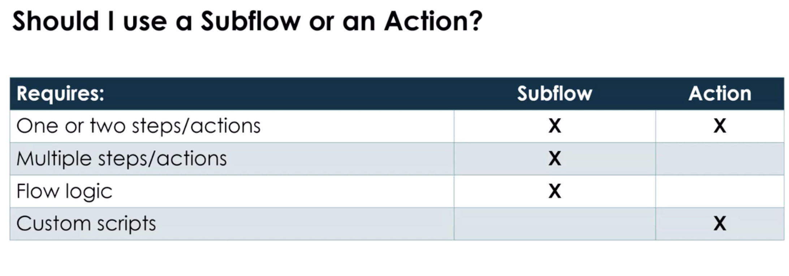

---

## Flow Script vs Business Rule

Feature Flow Script Business Rule

---

Execution Runs inside Flow engine Runs during DB transaction
Timing After trigger Before/After/Async
Scope Flow context Table-specific
Visibility Easy UI tracking Requires logs/debug
Complexity Should stay light Can handle heavy logic
Best For Orchestration logic Data integrity enforcement

### Key Difference

Flow Script is orchestration-focused.\
Business Rules are transaction-focused.

If the database operation must be controlled --- use a Business Rule.\
If you're automating a process --- use Flow.

---

## Flow vs Script Include

Feature Flow Script Include

---

Type Process automation tool Reusable code library
Reusability Limited (unless Action) High
Audience Admin + Dev Developer
UI Visual builder Code-only
Best For Process orchestration Shared business logic

### Rule of Thumb

If logic will be reused across:

- Business Rules
- Flows
- UI Actions
- APIs

→ Put it in a Script Include.

Flow should call Script Includes for complex reusable logic.

---

## Flow vs Workflow (Legacy)

Feature Flow Designer Workflow (Legacy)

---

Platform Direction Current standard Deprecated direction
UI Modern, visual Classic workflow editor
Extensibility Actions + Spokes Activities
Scripting Inline + Actions Script activities
Future Support Active development Maintenance mode

### Important!

- Workflow is legacy.
- Flow Designer is the strategic platform.
- New implementations should use Flow Designer.

Unless maintaining an older instance, choose Flow.

---

### mental model:

- **Script Include** = Logic Layer\
- **Business Rule** = Data Enforcement Layer\
- **Flow Designer** = Process Automation Layer

If you separate these correctly, your applications scale cleanly and you
avoid logic duplication.
