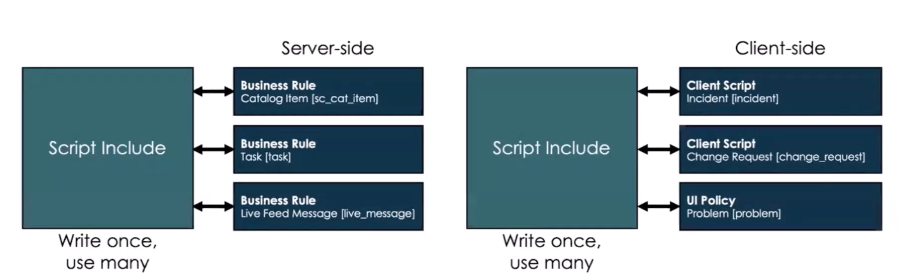
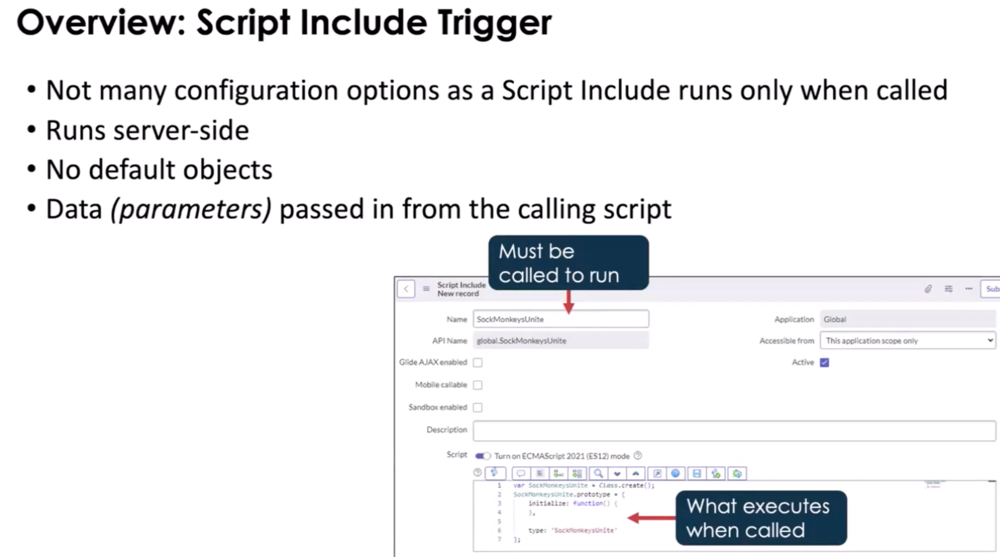
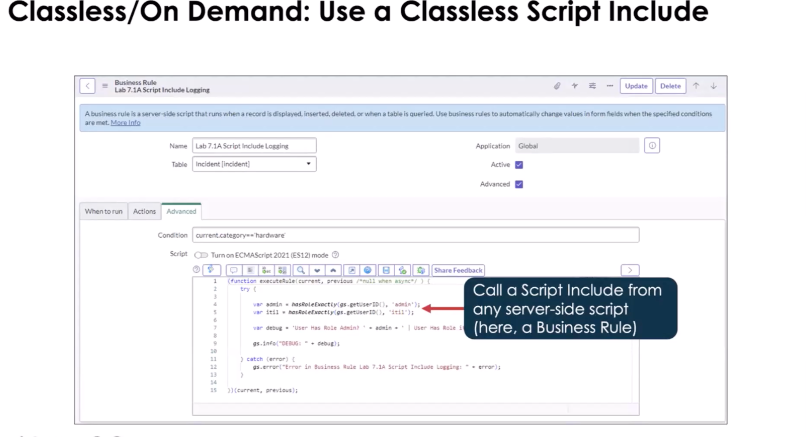

# Script Includes

## Purpose

- Stores reusable Javascript to execute server-side
- Centralize business rules

> A record in a table that allows us to store a JavaScript function that can be called from any where that server-side JS
> is acceptable or to store an entire new class that server-side js is accessible. The classes can be called client-side in
> some cases

> Note: The name of the script includes must match the name of the function of class it's calling

## Runs

- Server
- Called by other scripts and flows
- Runs only when called
- Client-callable (via GlideAjax)

## Types

#### Classless Function

By default, ServiceNow gives you class template for script includes. make sure you clear this out

- Re-usable
- Server-side only
- Executed on demand
- Can be called by a Business Rule, reference qualifier field, Event caller, embedded in an email notification

#### Script Include Class

- Defines a reusable class
- Can be called by client-side scripts (if client-callable)
- Naming convention: include `_Utils`

#### Extended Class

- Inherits from an existing class
- Adds or overrides functionality
- Can be client-callable if parent allows

## Use When

- Logic reused across BRs, Flows, APIs
- Complex business rules
- NOT for UI logic

## Touches

- Tables: varies
- APIs: GlideRecord, gs

## Common Mistakes

- Putting logic directly in Business Rules
- Forgetting client-callable flag
- Mixing UI logic into server code
- There are no access to the _current_ object.

## Good Practices

- Single responsibility
- Scope-aware
- Small, focused methods

## Mental Model

> Script Includes = Service Layer

## 1-Min Example

- Calculate SLA based on priority
