# Script Includes

## Purpose

- Stores reusable Javascript to execute server-side
- Centralize business rules

> A record in a table that allows us to store a JavaScript function that can be called from any where that server-side JS
> is acceptable or to store an entire new class that server-side js is accessible. The classes can be called client-side in
> some cases

> **Note:** The name of the script includes must match the name of the function of class it's calling

## Runs

- Server
- Called by other scripts and flows
- Runs only when called
- Client-callable (via GlideAjax)

## Types

#### Classless Function

By default, ServiceNow gives you class template for script includes. make sure you clear this out

- Re-usable
- Server-side only
- Executed on demand
- Can be called by a Business Rule, reference qualifier field, Event caller, embedded in an email notification

#### Script Include Class

- Defines a reusable class
- Can be called by client-side scripts (if client-callable)
- Naming convention: include `_Utils`

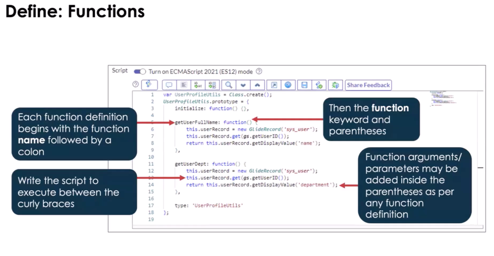

The below shows how to use the initialize function. This runs the moment that and object of this class is created.
(see lines 6 and 12 in the above, They are redundant)

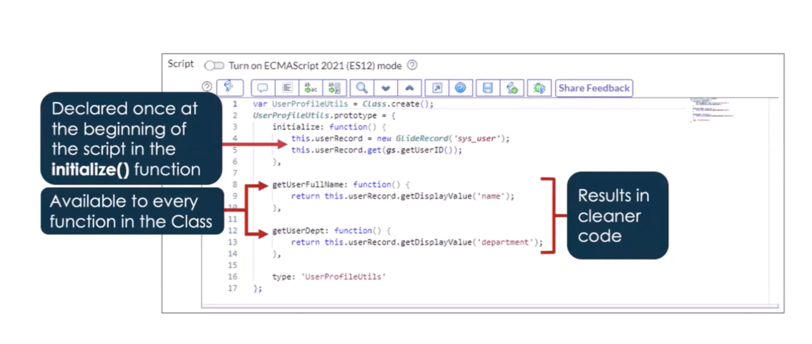

- Reference Qualifiers : simple, dynamic, advanced

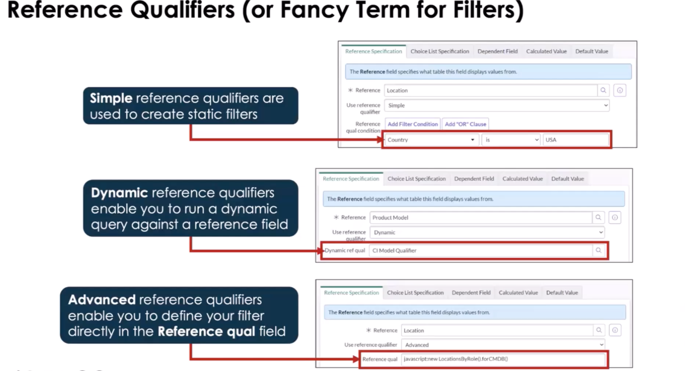

#### Extended Class

- Inherits from an existing class
- Adds or overrides functionality
- Can be client-callable if parent allows

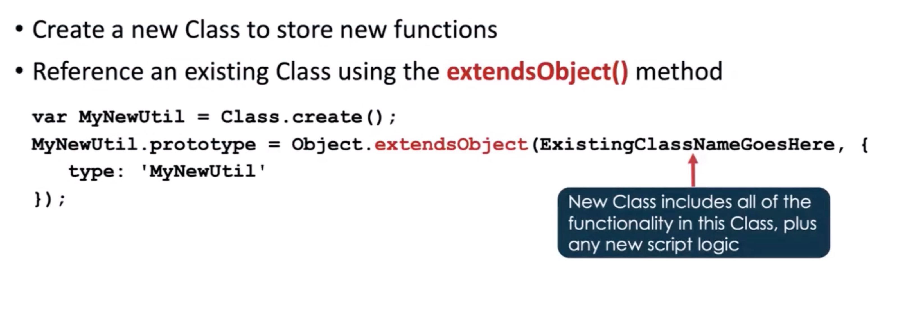

> **Why Do this**?
>
> _Search the baseline script includes to see where and why ServiceNow extends classes_
>
> - LDAP or Catalog Updates, extend so you don't ruing base functionality
> - AJAX Class Called "AbstractClassAjaxProcessor"

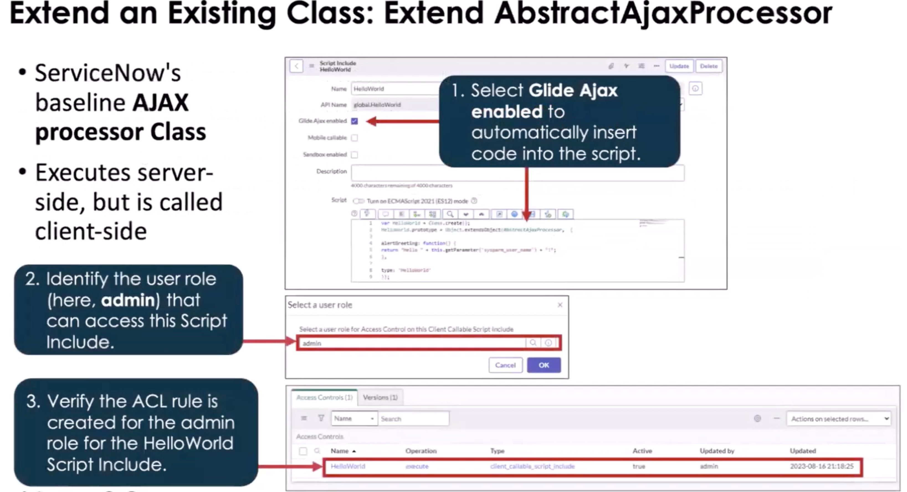

> Note: When using the AbstractAjaxProcessors class, it has the getParameter method that allows for client side
> JS to pass a value that will affect how the server-side JavaScript runs. (Glide AJAX)

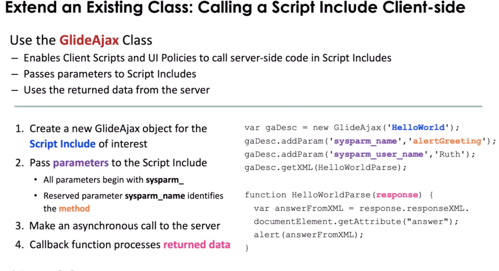

Pictured above we see how we can have client scripts and ui policies process things on the server, that would normally be
"expensive" for client-side to do.

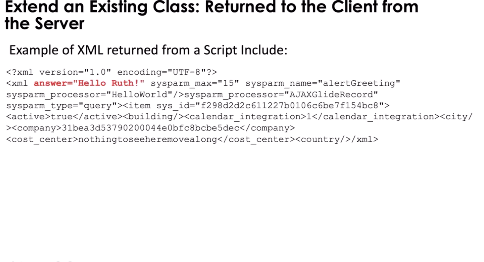

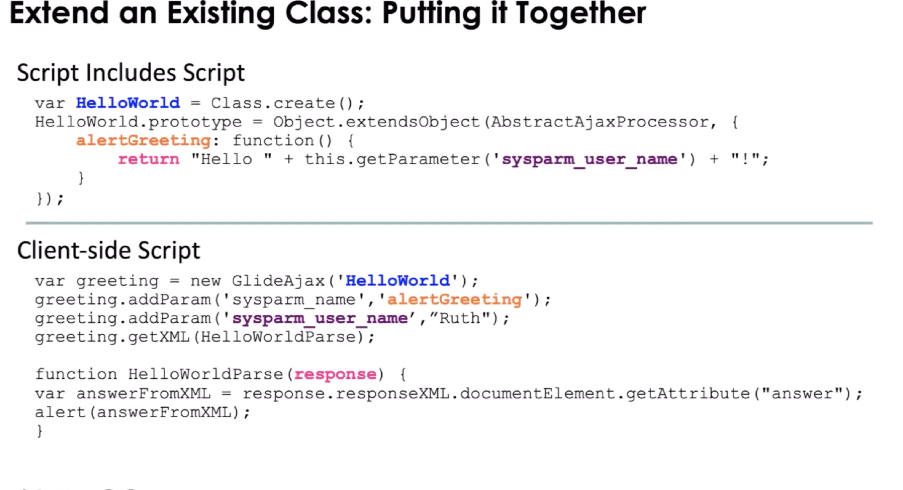

### JSON

Script Includes allows you to use JSON and pass data between client and server. (It still come back in an xml payload/wrapper but
you will not have to traverse the xml)

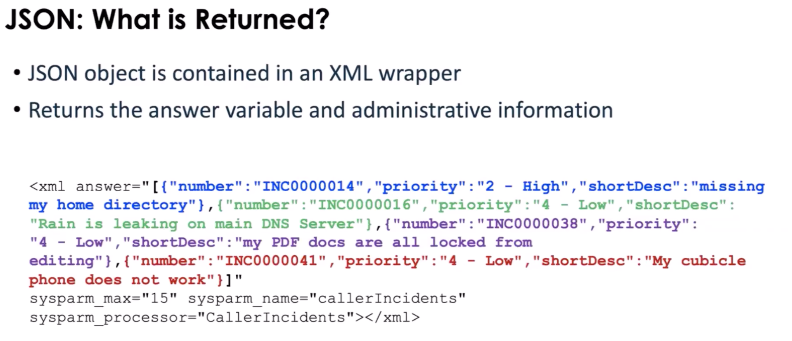

> Note: When calling an extended script include on the client side and you only want the answer attribute, you can use the .getXMLAnswer().
> You can create a callback to parse the xml if needed

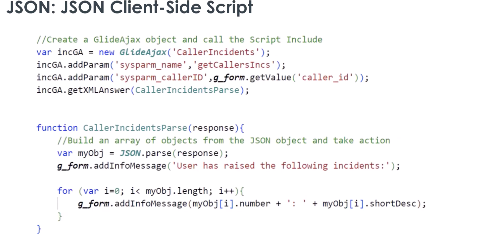

### State Model

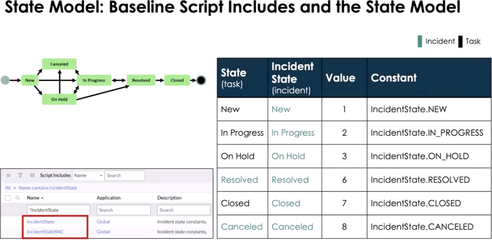

Pictured above we have Script Includes IncidentStateSNC, use this to store custom property values for the IncidentState and workflow.

## Use When

- Logic reused across BusinessRules, Flows, APIs
- Complex business rules
- NOT for UI logic

## Touches

- Tables: varies
- APIs: GlideRecord, gs

## Common Mistakes

- Putting logic directly in Business Rules
- Forgetting client-callable flag
- Mixing UI logic into server code
- There are no access to the _current_ object.
- Using g_scratchpad instead of GlideAjax
  - g_scratchpad only gets the data on load so if you need new data you have to reload the form.

## Application Scope

You can have public of private scope but how you call the script include will change based on scope.
A scope prefix is not required to call a script include in the same scope. To call a script include in another scope you must
prepend the script includes name with it's unique scope namespace. When you look at the details for the Script Include you
will see the API Name, use that when you need the entire name. You can only do this is the Script Include can be access from
other scopes.

> Note: When you have an app that is downloadable from the ServiceNow App Store, you have the option to use a protection policy
> on your script includes: Read-Only, Protected, or --None--.

## Good Practices

- Single responsibility
- Scope-aware
- Small, focused methods

## Mental Model

> Script Includes = Service Layer

## 1-Min Example

- Calculate SLA based on priority
