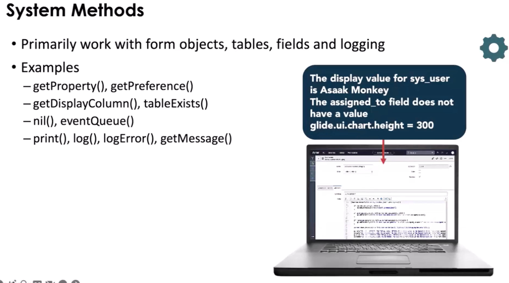
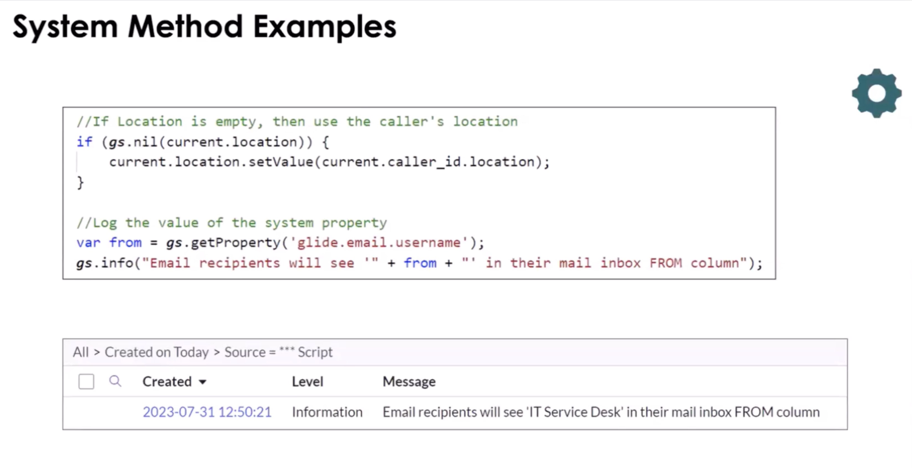
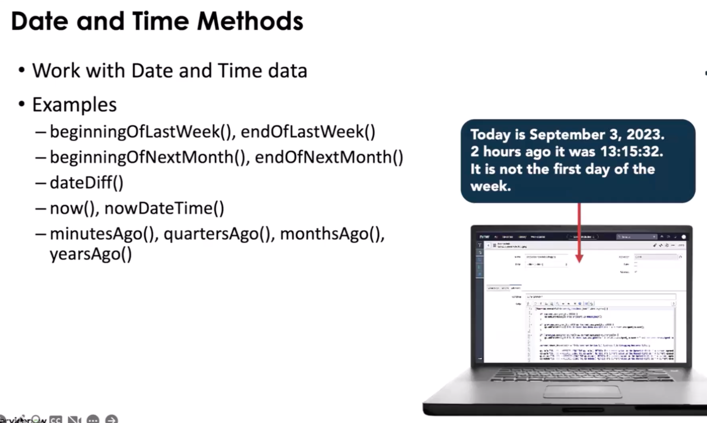
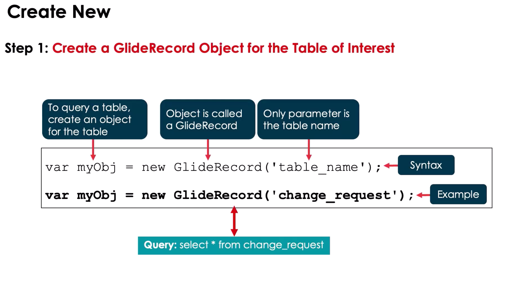
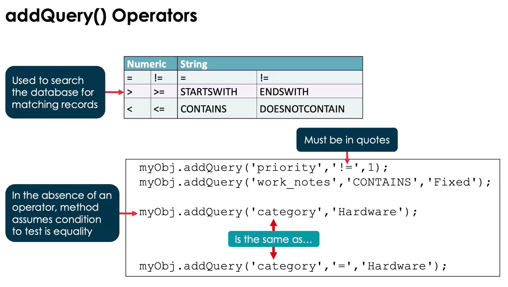
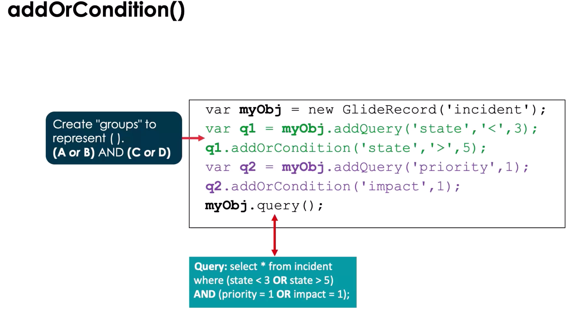
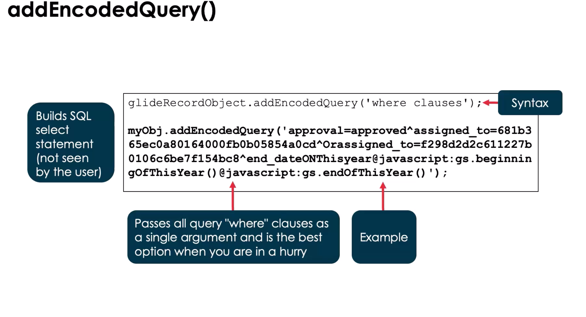

# Glide API Notes: GlideSystem & GlideRecord

This is a focused reference for **GlideSystem (gs)** and **GlideRecord**, the core server-side APIs in ServiceNow.
Use it for study, hands-on practice, or quick lookup.

Essentially it is a JavaScript class that can be used anywhere in the platform where server-side JavaScript is accepted.

- Business Rules
- UI Actions

---

## 1. GlideSystem (gs)

**Purpose:**

- Provides system-level utilities and context information.
- Mostly used in server-side scripts (Business Rules, Script Includes, Scheduled Scripts, Flow Script Steps).

**Runs:**

- Server


**Common Methods & Use Cases:**

| Method                    | Description                        | Example                                        |
| ------------------------- | ---------------------------------- | ---------------------------------------------- |
| `gs.log(message, source)` | Log info to system logs            | `gs.log('Incident closed', 'IncidentBR');`     |
| `gs.info(message)`        | Log info (simpler)                 | `gs.info('Process started');`                  |
| `gs.warn(message)`        | Log a warning                      | `gs.warn('High load');`                        |
| `gs.error(message)`       | Log an error                       | `gs.error('Failed update');`                   |
| `gs.getUser()`            | Current user object                | `var user = gs.getUser();`                     |
| `gs.getUserID()`          | Current user's sys_id              | `var user = gs.getUserID();`                   |
| `gs.getUserName()`        | Current user's username            | `var name = gs.getUserName();`                 |
| `gs.getUserDisplayName()` | Current user's display name        | `var display = gs.getUserDisplayName();`       |
| `gs.nowDateTime()`        | Current date-time                  | `var dt = gs.nowDateTime();`                   |
| `gs.daysAgo(n)`           | Date n days ago                    | `var weekAgo = gs.daysAgo(7);`                 |
| `gs.nil(object)`          | Checks if object is null/undefined | `if (gs.nil(current.short_description)) {...}` |
| `gs.addInfoMessage(msg)`  | Adds a message to UI               | `gs.addInfoMessage('Update successful');`      |
| `gs.addErrorMessage(msg)` | Adds an error message to UI        | `gs.addErrorMessage('Cannot save record');`    |
| `gs.sleep(ms)`            | Pause execution (server)           | `gs.sleep(500);`                               |
| `gs.nil(object)`          | Check if there is no value         | `gs.nil(current.location);`                    |





> **Note**: See the ServiceNow docs to review the GluideDate and GluideDatsTime API's to see other methods used to manipulate dates.



**Common Mistakes / Gotchas:**

- Using `gs.*` on client scripts (won’t work)
- Overusing logs in large batch scripts (can slow down execution)
- Forgetting that `gs.addInfoMessage()` only appears in UI, not API calls

**1-Min Example:**

```javascript
// Log user info when incident is closed
if (current.state == 7) {
  // Closed
  gs.log(
    "Incident " + current.number + " closed by " + gs.getUserName(),
    "IncidentBR",
  );
}
```

---

**Scoped GlideSystem:**

You must use Scoped APIs when developing scripts for scoped applications. There are error messages to inform users
if there are using a method that is in the wrong scope.

Examples:

- debug()
- erro()
- info()
- warn()
- isDebugging()

Navigate to System Logs > System Log > Errors to see output

## 2. GlideRecord (gr)

**Purpose:**

- Server-side API to query, create, update, and delete records in tables.

**Runs:**

- Server only (Business Rules, Script Includes, Scheduled Scripts, Flow Script Steps)

> Note: Can be called on the client side but there might be some performance issues



**Basic Workflow:**

```javascript
var gr = new GlideRecord("incident"); // Table name
gr.addQuery("priority", 1); // Query condition
// add other query conditions as needed
gr.query(); // Execute query
while (gr.next()) {
  // Iterate results
  gs.log(gr.number);
}

// Query: SELECT * FROM Incident WHERE priority = 1
```



**Common Methods & Use Cases:**

| Method                       | Description                         | Example                                                                         |
| ---------------------------- | ----------------------------------- | ------------------------------------------------------------------------------- |
| `new GlideRecord(tableName)` | Instantiate GlideRecord for a table | `var gr = new GlideRecord('incident');`                                         |
| `addQuery(field, value)`     | Add a query condition               | `gr.addQuery('state', 1);`                                                      |
| `addEncodedQuery(query)`     | Add encoded query                   | `gr.addEncodedQuery('priority=1^active=true');`                                 |
| `query()`                    | Execute query                       | `gr.query();`                                                                   |
| `next()`                     | Move to next record                 | `while(gr.next()) {...}`                                                        |
| `get(sys_id)`                | Retrieve a record by sys_id         | `gr.get('abc123');`                                                             |
| `insert()`                   | Insert new record                   | `gr.insert();`                                                                  |
| `update()`                   | Update current record               | `gr.update();`                                                                  |
| `deleteRecord()`             | Delete current record               | `gr.deleteRecord();`                                                            |
| `setValue(field, value)`     | Set field value                     | `gr.setValue('short_description', 'Updated');`                                  |
| `getValue(field)`            | Get field value                     | `var desc = gr.getValue('short_description');`                                  |
| `autoSysFields(false)`       | Skip system fields on insert/update | `gr.autoSysFields(false);`                                                      |
| `addOrConditon(condition)`   | Add a second condition to a select  | `myObj.addQuery('catagory', '=', 'Hardware').addOrContion('priority', '!=', 1)` |


**Common Mistakes / Gotchas:**

- Using `GlideRecord` on client scripts (won’t work)
- Forgetting `query()` before iterating results
- Using `update()` on a record that wasn’t retrieved
- Not respecting permissions when manipulating records
- Not using GlideAggregate to check if > 100 rows are returned or for tables that grow continuously.

**1-Min Example:**

```javascript
// Close all high-priority incidents
var gr = new GlideRecord("incident");
gr.addQuery("priority", 1);
gr.addQuery("state", "!=7");
gr.query();
while (gr.next()) {
  gr.state = 7; // Closed
  gr.update();
  gs.log("Closed " + gr.number);
}

// Example of addOrCondition
var gr = new GlideRecord("incident");
gr.addQuery("priority", 1);
gr.addQuery("state", "!=7").addOrContion("priority", "!=", "2");
gr.query();
while (gr.next()) {
  gr.state = 7; // Closed
  gr.update();
  gs.log("Closed " + gr.number);
}
```





> **Note**: You can build and addEncodedQuery() from the list view query selector. When you are done with your query,
> right click and you can copy the query.
>
> GlideRecordSecure performs the same actions as GlideRecord and enforces ACL rules
> If a record cannot be read do to ACLS, the column will be set to NULL

## Tips for Distinguishing GlideSystem vs GlideRecord Methods

- **GlideSystem**: System info, logs, user info, dates, messages. Never touches tables directly.
- **GlideRecord**: Table data access and manipulation. Always involves a specific table.
- Mental shortcut: **gs = system utilities**, **GlideRecord = database CRUD**.
- Both are **server-side only**. Use GlideAjax to call server from client.

---

## Glide Query

\*\*An alternative to GlideRecord that make take a bit longer that Glide Record

> **Note**: To improve performance, reduce the number of loops in the code.

- can be users to perform CRUD, written in JS, and uses GlideRecord behind the scenes
- Has three principles

### Fail Fast

- Run into errors ASAP and provide a feedback loop
  - Field checking
  - Choice Checking
  - Type Checking

### Be Javascript

- Behave like a JS library
- Returns a JS Objects
- Has a JS Stack Trace

### Be Expressive

- Do more with less lines of code
  - Stream Class
  - Optional Class

  **Use this document alongside hands-on practice.** Fill in examples from your dev instance to reinforce learning and retention.
